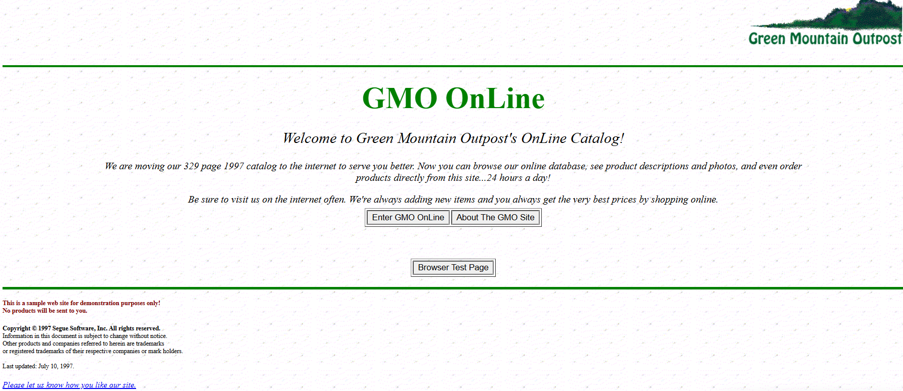

# Práctica 4 - Automatización de Pruebas  

  


## 🚀 Insignias  


---

## 📋 Índice  
1. [Descripción del Proyecto](#-descripción-del-proyecto)
2. [Estado del Proyecto](#-estado-del-proyecto)
3. [Demostración de Funciones y Aplicaciones](#-demostración-de-funciones-y-aplicaciones)
4. [Acceso al Proyecto](#-acceso-al-proyecto)
5. [Tecnologías Utilizadas](#-tecnologías-utilizadas)


---

## 📝 Descripción del Proyecto  
Este repositorio contiene el desarrollo de un proyecto para aplicar los conceptos de Calidad de Software mediante pruebas automatizadas. El enfoque principal es el Behavior Driven Development (BDD), utilizando tecnologías como HTML, Ruby, y Gherkin.

El objetivo principal es implementar smoke tests para validar que las funciones críticas de la aplicación web Green Mountain Outpost Online Catalog (GMO Online) están operativas. El proyecto se centra exclusivamente en estas pruebas rápidas, asegurando que las funcionalidades clave como la navegación por productos, la visualización de detalles y la simulación de compras funcionen correctamente

---

## 📌 Estado del Proyecto  
El proyecto se encuentra en **fase de desarrollo**. Actualmente, incluye pruebas funcionales básicas y smoke tests automatizados.  

---

## ✨ Demostración de Funciones y Aplicaciones  
### Funcionalidades Principales:
- **Especificación de escenarios** en lenguaje natural con Gherkin para facilitar la comunicación entre desarrolladores y clientes.
- **Automatización de pruebas** mediante Ruby y el framework Cucumber.
- **Integración modular** mediante una estructura organizada que incluye definiciones de pasos y archivos de soporte.


---

## 🌐 Acceso al Proyecto  
1. **Clonar el repositorio**  
   Descarga este repositorio a tu máquina local:  
   ```bash
   git clone https://github.com/ValeryArauco/Practica-4-Calidad.git
   cd Practica-4-Calidad
   ```

2. **Instalar dependencias**  
    Asegúrate de tener instalada la versión correcta de Ruby. Se recomienda utilizar:
    rubyinstaller-devkit-3.0.2-1-x64.exe.
    Luego, instala las dependencias del proyecto:  
   ```bash
   bundle install
   ```

3. **Ejecutar las pruebas**  
   Para ejecutar las pruebas automatizadas, utiliza el siguiente comando:  
   ```bash
   cucumber
   ```  
   Esto ejecutará todos los escenarios definidos en los archivos `.feature` dentro de la carpeta `features`.

   Para ejecutar un archivo .feature específico, utiliza el siguiente comando:

   ```bash
   cucumber features\<nombre-del-feature>.feature
   ``` 
   Ejemplo:
   ```bash
   cucumber features\8Receipt.feature  
   ``` 

    Para filtrar pruebas utilizando etiquetas especificadas en los escenarios, utiliza:
   ```bash
   cucumber features/<nombre-del-feature>.feature --tags '@<nombre-de-la-etiqueta>'
   ```
   Ejemplo:
   ```bash
   cucumber features/1calc.feature --tags '@SR'
   ```

4. **Explorar los resultados**  
   Los resultados de las pruebas se mostrarán en la consola. Si configuraste un formato de salida adicional, como HTML, los resultados se guardarán en un archivo de reporte.  
   
   4.1. **Reporte con formato detallado en consola**
   
   Genera una salida detallada en la consola para las pruebas etiquetadas:
   ```bash
   cucumber features/<nombre-del-feature>.feature -t @<nombre-de-la-etiqueta> --format pretty
   ```
   Ejemplo:
   ```bash
   cucumber features/1calc.feature -t @SR --format pretty
   ```

   4.2. **Reporte en formato HTML**
   
   Genera un reporte HTML y guarda el archivo en la ruta especificada:
   ```bash
   cucumber features/<nombre-del-feature>.feature -f html -o <ruta-del-reporte>.html
   ```
   Ejemplo:
   ```bash
   cucumber features/1calc.feature -f html -o reports/viernes.html
   ```

---

## 🛠 Tecnologías Utilizadas  
- **Ruby**
- **Cucumber**
- **Gherkin**
- **HTML**

 


